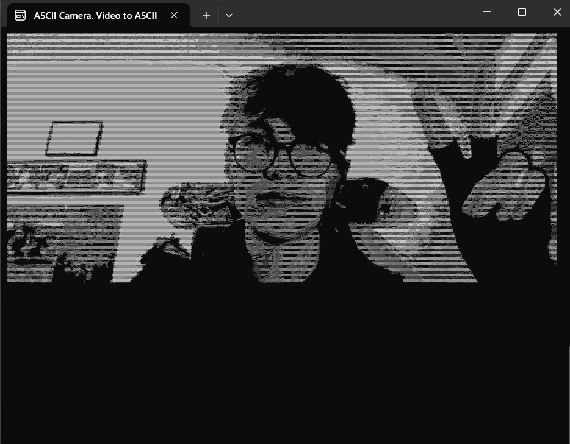

# ASCII Camera: A Fun Video-to-ASCII Converter

**ASCII Camera** is a fun and experimental project that converts webcam footage into an ASCII art video in real-time. This Proof-of-Concept (PoC) was built for entertainment and learning purposes. It is **not intended for commercial use**.


## Features

- **Real-time ASCII Conversion**: Uses the webcam to capture video and converts each frame into ASCII characters, which are displayed in the console.
- **Colorful or Monochrome**: Choose between colorful or monochrome output for the ASCII art. In colorful mode, each pixel is mapped to the closest console color.
- **Adjustable Resolution**: The output resolution can be adjusted based on the console window size.
- **Customizable Density**: The characters used for the ASCII representation can be customized for different levels of detail and contrast.
- **Webcam Integration**: Directly uses your PC's webcam feed for the video-to-ASCII conversion.

## How it Works

1. **Webcam Capture**: The program continuously captures frames from your webcam using OpenCV.
2. **Image Processing**: Each captured frame is processed into a bitmap. The pixels are then mapped to corresponding ASCII characters based on their brightness levels.
3. **Color Mapping**: In colorful mode, each pixel is assigned a console color closest to its RGB value.
4. **Rendering in Console**: The resulting ASCII art is displayed in the console window in real-time, simulating a video feed.
5. **User Interface**: The program allows users to choose between colorful or monochrome output, and displays the frame rate (FPS) and memory usage.

## Installation

To run this project locally, follow these steps:

1. Clone this repository:
   ```
   clone the repository
   cd ASCII-Camera
   open imgtoascii.exe
   have FUN

Usage

    Upon starting the program, you'll be asked to choose whether you want colorful or monochrome ASCII output.
    Additionally, the program will ask the resolution.
    The video feed from your webcam will be displayed as ASCII art in the console window.
    You can resize the console window to adjust the resolution, but keep in mind that extremely large windows may affect performance.

Limitations & Disclaimer

    Not for Commercial Use: This project is intended solely for fun and educational purposes. Do not use it for any commercial application.
    Performance: This program may not perform well with very large screen resolutions or low-performance hardware.
    Limited Accuracy: The video-to-ASCII conversion may not be perfect due to the limitations of the ASCII characters and the nature of the console display.
